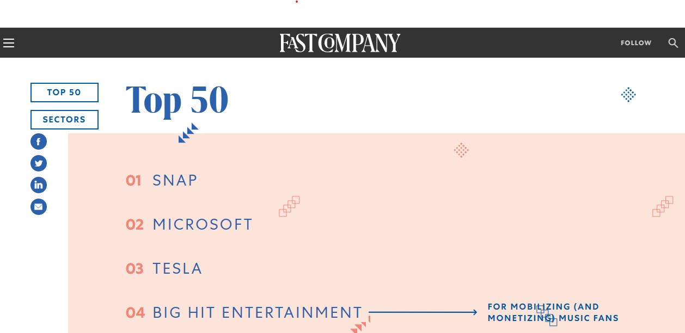
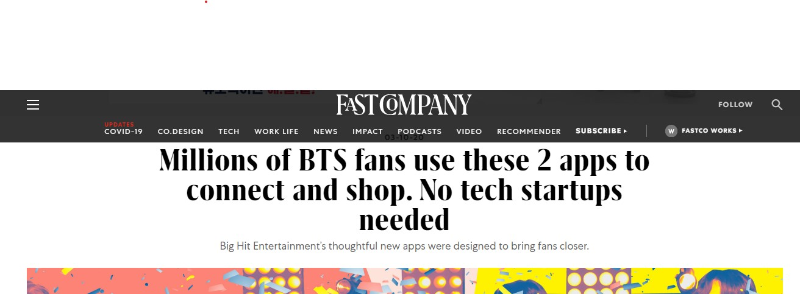

**

## 역사
- [나무 위키](https://namu.wiki/w/%EB%B9%85%ED%9E%88%ED%8A%B8%20%EC%97%94%ED%84%B0%ED%85%8C%EC%9D%B8%EB%A8%BC%ED%8A%B8?from=%EB%B9%85%ED%9E%88%ED%8A%B8)에 잘 나와 있다. 숙독.

## 회사 설명회 요약 (2020.08.13)
- 출처: [https://www.youtube.com/watch?v=MyGF8mFDMeI&feature=youtu.be](https://www.youtube.com/watch?v=MyGF8mFDMeI&feature=youtu.be)
- Label
  - 여자친구, Seventeen을 보유한 Pledis 인수
  - BTS
    - 내용 생략
  - Seventeen (2015 데뷰)
    - 최신앨범 행가레도 120만장이 팔렸다. (국내 2위)
    - 13명 구성
  - TXT
    - 50개국에서 iTunes 앨범차트 1위 (일본 포함)
    - 2020.11월 빌보드 200 차트 25위 랭크 ([출처](https://en.wikipedia.org/wiki/Minisode1:_Blue_Hour#Commercial_performance))
  - Enhypen
    - I-LAND (온라인에서 오디션을 하는 듯?) 출신. CJ ENM과의 합작사인 빌리프랩 소속 (빅히트 지분 48%)
    - 역대 남자 아이돌 데뷔 앨범 초동 판매량 3위
  - Global girl group
    - 전세계 16곳에서 오디션, 21년 데뷰 예정
- Business
  - 아티스트가 직접적으로 시간을 쓰지 않는 간접 참여형 수익 비중이 22.3% -> '19년 46.4%로 증가
    - Tiny Tan
      - 애니메이션형 BTS
      - 다우니 세제 CF 도 찍음
  - Goods
    - 2020년 상반기 458종 판매됨
  - 라이센스 사업
    - 갤럭시 BTS 에디션, 한시간에 완판
    - 스타벅스 BTS 파트너 제품, 하루만에 90% 판매됨
- Original Content Brending
  - 한마디로 BTS의 모든 모습을 듯텐츠화함. 쉬는 모습, 운동하는 모습, 휴가간 모습 등등. TV 방영도 한다고. (한국, 일본)
  - 투어를 본 사람 수 만큼의 사람이 간접 컨텐츠로 BTS를 접한다.
  - 컨텐츠를 Weverse 에서 감상, 구매할 수 있다.
- 플랫폼
  - Weverse 앱 다운로드수 1천만
    - 컨텐츠 감상, 티켓 구매, 대기시간 체크 등
    - _방방콘_ 공연을 6개 뷰로 감상하고 공연후 1주동안 74만개 Goods 판매
    - Seventeen 온라인 팬 사인회는 14개의 앵글로 촬영 예정
  - 교육
    - "Learn Korean with BTS" 라는 교육 프로그램 운영
      - 교재도 Weverse 에서 판매, 한국 외대와 협약. 해외 대학 교제로 채택
  - 게임
    - 넷마블과 함께 함
  - https://www.fastcompany.com/most-innovative-companies/2020
    
    

## Weverse

- 가수들 목록이 있고, 가수를 선택해서 들어가면 팬들이 글을 남길 수 있다.
- 가수들 비디오 콘텐츠는 유료가 많다.
- BTS, 선미, 핸리, TXT, 세븐틴, 그레이시 에이브럼스 (미국 가수) 등
- 멤버십을 가입하는데, BTS는 25,000원, 키트까지 구매하면 14,000원. 멤버십 가입자만 살 수 있는 굿즈 팩이 있는데, 175,000원이나 함.
- '갤럭시 S20+ BTS 에디션'에 위버스가 기본 애플리케이션으로 탑재
- 스트리밍으로 유료 콘서트 진행.
   - "미국 투어링데이터가 최근 발표한 자료에 따르면 방탄소년단의 콘서트 'MAP OF THE SOUL ON:E'(맵 오브 더 소울 원)는 지난해 열린 온라인 콘서트 중 가장 높은 수익을 올린 것으로 나타났다. 지난해 10월 이틀간 열린 이 콘서트는 191개 지역에서 유료관객 99만3000여명으로부터 4400만달러(한화 약 495억원) 이상을 벌어들였다. 더불어 방탄소년단은 지난해 6월 열린 유료 콘서트 '방방콘 : 더 라이브'로도 107개 지역에서 75만6000여명의 유료 시청자를 모아 2000만 달러(약 225억원)의 수익을 창출했다.", [출처](https://m.sportsworldi.com/view/20210207502592)
- 즉, 빅히트가 온라인에서 돈을 버는 창구 역할을 하고 있음

### 엔터테인먼트 플랫폼 비즈니스

- "빅히트가 공룡 IT기업인 네이버와 카카오에 대한 경계심을 드러내면서 관심을 끌고 있다." ... "네이버는 지난달 엑소와 레드벨벳 등 정상급 K팝 아이돌을 거느린 SM엔터테인먼트에 약 1천억원을 투자하기로 했다. 이 투자로 SM이 그간 운영해오던 자체 팬클럽 서비스 '리슨'은 네이버 'V라이브' 산하 글로벌 멤버십 커뮤니티 '팬십'으로 이관된다." ... "2017년 네이버는 YG엔터테인먼트의 지분을 1천억원 규모로 인수해 2대 주주에 오르기도 했다."... "카카오는 2016년 가수 아이유의 소속사이자 음원 플랫폼 멜론 운영사인 로엔엔터테인먼트를 인수하면서 본격적으로 엔터 분야 진출을 알렸다. 이후 카카오는 엔터테인먼트 계열사 카카오M을 출범해 연기자 기획사 7곳, 영화사 2곳, 드라마제작사 3곳, 음악 레이블 4곳, 공연제작사 1곳 등을 거느린 엔터계의 주요 기업으로 자리 잡았다." - [출처](https://news.einfomax.co.kr/news/articleView.html?idxno=4105689)

### 경쟁자

- Naver V라이브
  - Weverse와의 제휴 후, "2022년 1분기에 서비스 종료가 될 예정이다." 라고 https://namu.wiki/w/V%20LIVE 에 나와 있으나 출처가 없음.
- 유튜브

## 최근 협력 사항
- YG Plus
  - "빅히트는 27일 이사회를 열고 자회사 비엔엑스와 함께 YG 자회사 YG플러스에 총 700억원 규모의 투자를 단행한다고 밝혔다. 빅히트가 300억원, 비엔엑스가 400억원 등 총 700억원 규모의 투자를 진행한다는 것." - [출처](https://www.chosun.com/entertainments/entertain_photo/2021/01/27/J4KFNOP5PQP3NHKRIKTIOVTJUI/)
    - YG Plus 의 17.8% 취득
  - YG Plus 는?
    - 음원반 투자 유통, 콘텐츠 소싱, 및 Naver VIBE 운영대행, 캐릭터 사업
    - YG Entertainment의 신보 음반 및 음원 콘텐츠 독점. ([출처](http://m.businesspost.co.kr/BP?command=mobile_view&num=109419))
    - 분기/반기 보고서를 읽어봐도 상세 내용이 없다.
  - 영향
    - 빅히트 가수들 음원 유통을 YG Plus가 맡게 될 듯...이라고 기사들은 말하는데... 나의 의견은 "굳이....??" 이다.
    - 그것보다 빅히트의 플랫폼 개발 자회사인 beNX 가 400억을 투자한 것은, **YG Plus 가 유통하는 음원인 "블랙핑크"가 Weverse에 입점하게 될거라는 뜻이 아닐지?** 즉, BTS 만 가지고 장사하지 않고 블랙핑크로도 뭔가 수입을 거두갰다는 의미로 보인다.
- Naver
  - "2021년 1월 27일, 네이버가 Weverse 운영사인 beNX의 주식 49%를 취득하고 beNX는 네이버의 V LIVE 사업부를 양수해 1년의 기간을 거쳐 향후 Weverse와 V LIVE가 통합할 예정이라 한다.", "네이버, 비엔엑스에 4천118억 투자…비엔엑스는 브이라이브 사업부 양수" , [출처](https://www.yna.co.kr/view/AKR20210127166051017)
    - 양수한다고 했으니, 굳이 두개로 가져갈 필요가 없을 것 같다.
    - "플랫폼 통합 작업은 1년 정도 진행될 예정이며, 이 기간 두 서비스는 각자 운영된다.", [출처](https://www.yna.co.kr/view/AKR20210127166051017)
    - "네이버에서 브이라이브를 비롯해 카페·밴드 등 그룹 커뮤니티 전문 조직인 '그룹앤(&) CIC'를 이끄는 김주관 대표가 비엔엑스의 최고기술책임자(CTO)를 맡아 통합 작업을 이끌고 향후 전체 기술을 총괄할 예정이다.", [출처](https://www.yna.co.kr/view/AKR20210127166051017)
      - 김주관 대표: Band, Cafe 등을 운영해왔다 함
      - "특히 CIC 대표는 네이버 안에서 최고재무책임자(CFO), 최고커뮤니케이션책임자(CCO) 등 C레벨 임원들과 비슷한 수준의 고위직 인사다.", [출처](https://www.thebell.co.kr/free/content/ArticleView.asp?key=202008101426283520103626&lcode=00)
      - 나쁘지 않아 보임
  - 참고: Weverse 의 Google Play 다운로드수 500만, V Live 는 5,000만 건
  - 네이버가 49%나 투자하여 beNX가 네이버의 계열사가 되었음. 즉 주식 용어로는 관계사, 관계기업이 되었고 (지분 30~50%) beNX의 이익이 네이버의 재무제표에 반영되게 됨.
- Universal Music
  - VenewLive 라는 스트리밍 서비스를 빅히트, YG, Kiswe 가 손잡고 런칭. [출처](https://platum.kr/archives/157748), [영문](https://www.universalmusic.com/big-hit-yg-umg-and-kiswe-join-forces-for-global-live-streaming-platform/)
    - Kiswe 는 멀티 채널 (여러 카메라를 사용해 중계) 융합 기술을 보유한 라이브 스트리밍 업체
    - VenewLive 는 Big hit와 Kiswe가 21년 9월에 만든 서비스라는 말이 있음
  - [https://venewlive.com/](https://venewlive.com/)에는 현재 빅히트 가수들과 저스틴 비버, AJR (빌보드 200에서 8위로 데뷰한 인디팝 밴드) 올라와 있음.
  - "현재 그레이시 에이브럼스 (Youtube 1~2M view. 노래는 내 취향이네), 영블러드, 뉴 호프 클럽 (영국 차트 5위까지 갔었음) 등 유니버셜뮤직그룹 소속 4팀은 이미 위버스에 입점 계약을 맺었다. " [출처](https://www.hankyung.com/it/article/202102047285i)
    - 아직 대형 가수들은 안 들어온 듯

## 느낌
- Label 사업
  - 대스타를 키우는데는 시간이 많이 든다.
  - BTS는 2013 데뷰라, 멤버들 나이대는 23~28 이 되었다. 멤버들이 나이를 먹으면 그 다음에는 어떻게 될지? 그래서 계약을 7년간 더 한거 아닐지 싶기도 하다.
  - TXT 는 2019 데뷰인데 상대적으로 노하우 축적 때문인지 더 빨리 월드무대에 데뷰하였다.
  - 케바케이지만 노하우가 있으니 가능성은 높다.
  - 코로나가 종식되면 공연이 활성화되면서 매출은 증가할 것으로 생각된다.
- 플랫폼 사업
  - 플랫폼 사업은 최소한 아시아권에서는 자리잡지 않을까? 최소한 BTS와 블핑이 있으니.
  - BTS 수입은 100% 빅히트로 들어오는데 Weverse를 통한 블핑 수입은 얼마나 빅히트가 가지게 될까? 10%? 크지는 않을 듯. 10%라 치면 블핑같은 그룹을 10개 끌어와야 블핑을 보유한 것과 비슷한 수익을 내는데... 아티스트 포섭이 얼마나 가능할까? 이런 대형 가수를 얼마나 끌어들이냐가 중요할 듯.
  - UMG (유니버셜 뮤직)이 얼마나 VenewLive를 중요하게 생각하는지는 잘 모르겠음. 돌 한수 깔아놓는 느낌으로 투자한 것일수도.
  - 플랫폼 사업에서 빅히트 아티스트 제외하면 Label 사업만큼 돈을 벌게될지는 의문이다. 비디오 스트리밍 사업을 보면 넷플릭스도 있지만 다른 애들도 엄청 많다. 디즈니+ 처럼 스타 콘텐츠를 가지면 자기네가 직접 플랫폼을 하기 마련이다. 이 시장은 과점하는 플랫폼이 생긴다기보다 여러 플랫폼이 공존하게 될 것 같다.
- 결론적으로, 잘 될 것 같은데.. 얼마나? 라고 하면 잘 모르겠다. 미래 가치 산정이 매우 어렵다.
**